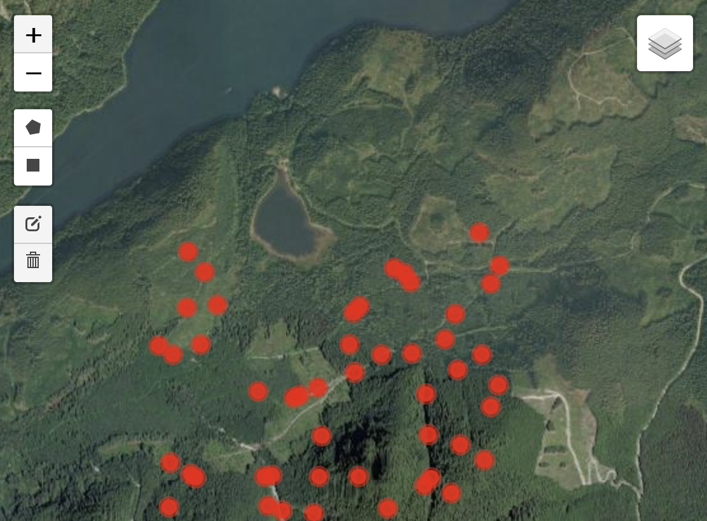
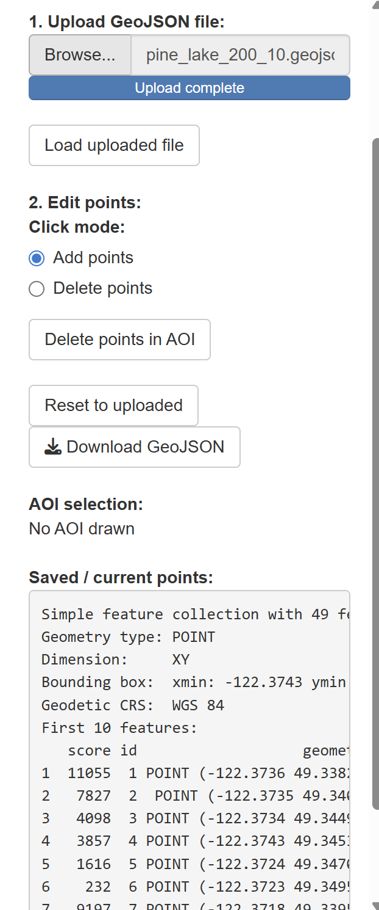

# LoggingRoadExtraction

A LiDAR-based pipeline for extracting logging road centrelines from Digital Elevation Models (DEMs). The pipeline runs in three stages: seed generation, raster-to-vector conversion, and least-cost path road extraction, with an optional interactive point editing step between stages 2 and 3.

> For the theoretical background behind each stage, see [THEORY.md](THEORY.md).

---

## Requirements

| Package | Purpose |
|---|---|
| `terra` | Raster I/O, focal filtering, terrain analysis |
| `whitebox` | Profile curvature via WhiteboxTools |
| `autothresholdr` | Otsu automatic thresholding |
| `sf` | Vector I/O, CRS transforms, GeoJSON output |
| `RANN` | Fast nearest-neighbour search for point snapping |
| `gdistance` | Least-cost path transition matrix |
| `raster` | Required by `gdistance` |
| `shiny` + `leaflet` | Interactive point editing app |
| `leaflet.extras` | Draw toolbar for AOI selection |
| `leafem` | Raster display in Leaflet |

Install all at once:
```r
install.packages(c("terra", "whitebox", "autothresholdr", "sf", "RANN",
                   "gdistance", "raster", "shiny", "leaflet",
                   "leaflet.extras", "leafem"))
```

---

## Setup

### 1. Configure your environment

Copy `local.env.example` to `local.env` and fill in your local paths:

```ini
DIR_IN=path/to/your/input
DIR_OUT=path/to/your/output
DIR_TMP=path/to/your/tmp
SKELETONIZE_PATH=path/to/skeletonize.R
```

> `local.env` is machine-specific and should **never be committed to git** — it is already listed in `.gitignore`.
> Algorithm parameters live in `settings.env` and are safe to commit.

### 2. Place your input DEM

```
input/
└── your_dem.tif
```

Update `FILE_NAME` in `settings.env` to match your filename.

### 3. Load environment at the top of each script

Every script sources `EnvLoader.R` which reads both `local.env` and `settings.env` and assigns all variables:

```r
source("EnvLoader.R")
```

---

## Directory Structure

```
LoggingRoadExtraction/
├── input/
│   └── your_dem.tif                  # Input LiDAR DEM
├── output/
│   ├── profcurv_cc.tif               # Intermediate: profile curvature
│   ├── seeds_combined.tif            # Stage 1 output: seed likelihood map
│   └── seed_points.geojson           # Stage 2 output: candidate road nodes
├── images/
│   ├── createSeeds.png               # Stage 1 workflow diagram
│   ├── rasterToVector.png            # Stage 2 workflow diagram
│   ├── map_sample_screen.png         # App map view screenshot
│   └── menu_sample_screen.png        # App menu screenshot
├── tmp/                              # Temporary working files
├── createSeeds_v2.R                  # Stage 1
├── RasterToVector.R                  # Stage 2
├── PointEditingApp_v2.R              # Stage 2b — interactive point editor
├── RoadExtraction.R                  # Stage 3
├── skeletonize.R                     # Zhang-Suen thinning (sourced internally)
├── EnvLoader.R                       # Loads local.env + settings.env
├── local.env                         # Your local paths  ← do not commit
├── local.env.example                 # Template for local.env
├── settings.env                      # Algorithm parameters
├── README.md
└── THEORY.md
```

---

## Stage 1 — Seed Generation (`createSeeds_v2.R`)

Generates a continuous seed likelihood map (0–1) from the input DEM by combining three terrain-derived feature streams: slope difference, multiscale roughness, and profile curvature edges. Each stream is independently normalized using Otsu thresholding and averaged into a single road probability surface.

### Workflow


### Run

```r
source("createSeeds_v2.R")
```

**Output:** `output/seeds_combined.tif` — pixel values in [0, 1] representing road likelihood.

### Key parameters in `settings.env`

| Parameter | Default | Description |
|---|---|---|
| `FILE_NAME` | — | Input DEM filename |
| `SLOPE_SMOOTH_WINDOW` | `51` | Low-pass filter window for slope smoothing |
| `ROUGHNESS_SD_SMALL` | `5` | Small roughness window size (pixels) |
| `ROUGHNESS_SD_MED` | `11` | Medium roughness window size (pixels) |
| `ROUGHNESS_SD_LARGE` | `21` | Large roughness window size (pixels) |
| `SOBEL_SIZE` | `5` | Sobel edge detection kernel size |
| `GAUSSIAN_SIZE` | `21` | Gaussian smoothing kernel size |
| `GAUSSIAN_SIGMA` | `3` | Gaussian smoothing sigma |

---

## Stage 2 — Raster to Vector (`RasterToVector.R`)

> Must be run in the **same R session** as Stage 1. Uses the `seeds` object held in memory.

Converts the seed raster to a thinned, snapped set of georeferenced candidate road nodes using skeletonization, connected component filtering, focal snapping to road-centre peaks, and grid-based point thinning.

### Workflow


### Run

```r
source("RasterToVector.R")
```

**Output:** `output/seed_points.geojson` — point layer with a `score` attribute representing seed probability at each snapped road-centre location.

### Key parameters in `settings.env`

| Parameter | Default | Description |
|---|---|---|
| `PROB_THRESHOLD` | `0.2` | Minimum seed score to include a pixel |
| `DO_OPENING` | `FALSE` | Apply morphological opening before skeletonization |
| `OPENING_SIZE` | `3` | Kernel size for opening (pixels) |
| `MIN_SKEL_BLOB_PX` | `1` | Minimum skeleton fragment size (pixels) |
| `MIN_COMPONENT_LEN_M` | `10.0` | Minimum skeleton component length (metres) |
| `MIN_SPACING_M` | `200.0` | Grid cell size for point thinning (metres) |

---

## Stage 2b — Interactive Point Editing (`PointEditingApp_v2.R`) *(optional)*

A Shiny web application for manually reviewing and editing the candidate seed points on an interactive map before running the road extraction. This quality-control step allows the operator to correct errors from automated seed generation — removing false positives and adding missed road segments.

### Run

```r
shiny::runApp("PointEditingApp_v2.R")
```

### Map view

The map displays seed points as red circle markers over a satellite or street map basemap. The seed raster can be toggled on/off using the checkbox in the control panel.



### Control panel

Upload your GeoJSON point file, switch between Add/Delete modes, draw an AOI polygon to bulk-delete points, reset to the original upload, and download the edited result.



### Workflow

1. Upload the `seed_points.geojson` output from Stage 2 using the file browser.
2. Click **Load uploaded file** to display points on the map.
3. Use **Add points** mode to click anywhere on the map to place new points.
4. Use **Delete points** mode to click individual markers to remove them.
5. Draw a polygon or rectangle using the toolbar (left side of map) to define an AOI, then click **Delete points in AOI** to bulk-remove all enclosed points.
6. Click **Download GeoJSON** to save the edited point set for use in Stage 3.

### Controls reference

| Control | Description |
|---|---|
| Show seed raster | Toggle the seed likelihood raster overlay on/off |
| Upload GeoJSON | Load a `.geojson` or `.json` point file |
| Load uploaded file | Render uploaded points on the map |
| Add points | Click mode: add a new point at each map click |
| Delete points | Click mode: remove a point by clicking its marker |
| Delete points in AOI | Remove all points within the drawn polygon/rectangle |
| Reset to uploaded | Restore points to the last uploaded file |
| Download GeoJSON | Export current points as a `.geojson` file |

---

## Stage 3 — Road Extraction (`RoadExtraction.R`)

Connects the edited seed points via least-cost paths to reconstruct road centrelines. Builds a conductance surface from the inverted seed raster, computes a transition matrix, and greedily chains points into road segments using Dijkstra's algorithm.

### Run

```r
source("RoadExtraction.R")
```

**Output:** `output/final_road_line.geojson` — line layer with a `line_id` attribute grouping connected road chains.

### Key parameters in `settings.env`

| Parameter | Default | Description |
|---|---|---|
| `EDITED_FILE` | — | Input edited points filename |
| `FINAL_ROAD_LINE` | — | Output road lines filename |
| `COST_BARRIER_VALUE` | `500` | Penalty assigned to high-cost barrier cells |
| `TR_DIRECTIONS` | `16` | Transition matrix directions (8 or 16) |
| `MAX_DISTANCE_THRESHOLD` | `1.5` | Search radius multiplier (× `MIN_SPACING_M`) |
| `MEAN_COST_THRESHOLD` | `100` | Maximum mean path cost to accept a connection |
| `MIN_SEGMENTS_PER_LINE` | `1` | Minimum segments to keep a road chain |

---

## Notes

- `createSeeds_v2.R` and `RasterToVector.R` **must be run in the same R session** — `RasterToVector.R` uses the `seeds` `SpatRaster` object held in memory and does not reload it from disk automatically.
- Add `local.env` to `.gitignore` to avoid committing machine-specific paths. The provided `.gitignore` already includes this.
- `skeletonize.R` must be present in the project root — it is sourced automatically by `RasterToVector.R` via the `SKELETONIZE_PATH` variable in `local.env`.
- On large DEMs, Stage 1 can be memory-intensive. Intermediate objects are cleared with `rm()` + `gc()` after each processing step.
- If the Shiny app raster overlay does not appear on startup, ensure `session$onFlushed` has fired before `leafletProxy` is called — this is handled automatically in `PointEditingApp_v2.R`.