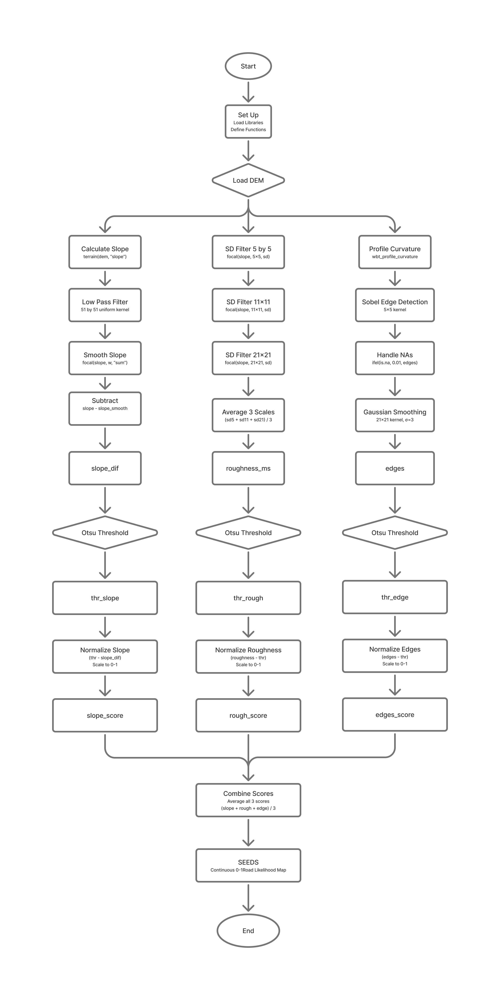
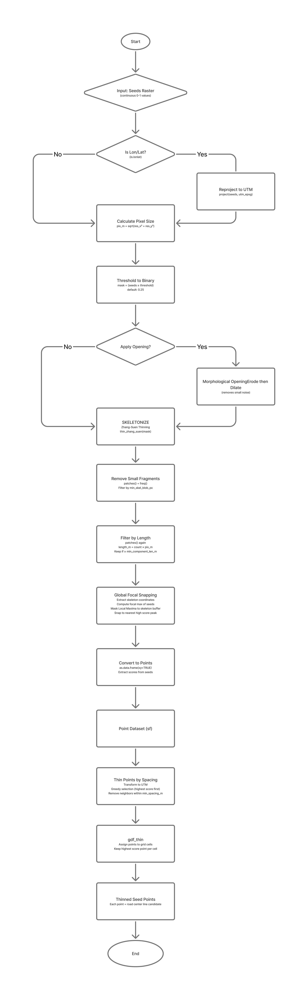

# LoggingRoadExtraction


## Stage 1 - Seed Generation (`createSeeds.R`)

A LiDAR-based road detection pipeline that generates a continuous **seed likelihood map** (0–1) from a Digital Elevation Model (DEM). The seed layer identifies candidate road pixels by combining terrain-derived evidence across three parallel feature streams, each independently normalized and fused into a single probability surface.

### Workflow



###  Theory

#### 1. Slope Difference (`slope_dif`)
Raw slope captures local gradient, but roads do not simply have low slope — they have **locally low slope relative to their surroundings**. A large uniform low-pass filter (51×51 kernel) estimates the regional slope trend. Subtracting this smoothed surface from the raw slope isolates pixels that are **anomalously flat** compared to their neighbourhood, which is a strong indicator of road cuts or fills.

$$slope_{dif} = slope - slope_{smooth}$$

Low (negative) values of `slope_dif` indicate road-like flatness.

#### 2. Multiscale Roughness (`roughness_ms`)

Roads are smooth. Surface roughness — estimated as the standard deviation of slope within a focal window — is low over road surfaces and high in forested or rocky terrain. To be robust across varying road widths and contexts, roughness is computed at three spatial scales (5×5, 11×11, 21×21 pixels) and averaged:

$$roughness_{ms} = \frac{\sigma_5 + \sigma_{11} + \sigma_{21}}{3}$$

Roads consistently exhibit **low roughness at all scales**, making this a multi-scale discriminator that is less sensitive to noise at any single scale.

#### 3. Profile Curvature Edges (`edges`)

Profile curvature measures how the slope is changing along the direction of maximum gradient. Roads intersect natural terrain at sharp transitions (road shoulders/ditches), creating strong **linear curvature discontinuities**. These are detected by applying a 5×5 Sobel edge detector to the profile curvature layer. The resulting edge magnitudes are smoothed with a 21×21 Gaussian kernel (σ=3) to reduce noise and widen the signal around road boundaries:

$$edges = \mathcal{G}_{\sigma=3} \left( \| \nabla \, profcurv \| \right)$$

High edge magnitude indicates sharp terrain breaks consistent with road margins.

#### Otsu Thresholding & Score Normalization

Each of the three feature layers is automatically thresholded using **Otsu's method**, which finds the optimal binary split by minimizing intra-class variance. Rather than using the binary result directly, the threshold is used as a **reference point** for soft normalization:

- Values above (or below, for slope) the Otsu threshold are treated as road-positive evidence.
- The margin from the threshold is scaled to [0, 1] by dividing by the maximum observed margin.

This produces a continuous *score* per feature that reflects both **membership** (above/below threshold) and **confidence** (how far above/below).

#### Score Fusion

The three normalized scores are averaged into a single seed strength raster:

$$seeds = \frac{slope_{score} + rough_{score} + edges_{score}}{3}$$

Values near 1.0 indicate strong, convergent evidence from all three terrain signals that a pixel lies on or near a road surface. This continuous output is suitable for use as a cost surface or seed layer in subsequent least-cost path analysis.

### Dependencies
| Package | Purpose |
|---|---|
| `terra` | Raster I/O, focal filtering, terrain analysis |
| `whitebox` | Profile curvature via WhiteboxTools |
| `autothresholdr` | Otsu automatic thresholding |

---
### Directory Structure

```
project/
├── input/
│   └── your_LiDAR_data.tif          # Input LiDAR DEM
├── output/
│   ├── profcurv_cc.tif        # Intermediate: profile curvature
│   └── seeds_combined.tif     # Final output: seed likelihood map
└── tmp/                       # Temporary working files
```

---
### Output from createSeeds.R

`seeds_combined.tif` — a single-band raster co-registered with the input DEM, with pixel values in [0, 1] representing road likelihood. Higher values indicate stronger convergent evidence of road presence across slope, roughness, and curvature edge features.


## Stage 2 — Raster to Vector (`RasterToVector.R`)

Converts the `seeds` probability raster into a **thinned set of georeferenced seed points** (GeoJSON) that are snapped to true road-centre peaks. These points serve as start/end node candidates for subsequent least-cost path analysis. The core function is `seeds_to_points()`.

### Workflow


### Theory

#### 1. Thresholding & Binary Mask

The continuous seed surface is binarized at a user-defined `prob_threshold`. Pixels at or above this value are treated as candidate road pixels. An optional morphological **opening** (erosion via `focal min` followed by dilation via `focal max`) can be applied to remove isolated noise pixels before skeletonization.

#### 2. Skeletonization (Zhang-Suen Thinning)

The binary road mask is reduced to a **1-pixel-wide skeleton** using the Zhang-Suen iterative thinning algorithm (sourced from `skeletonize.R`). This collapses road-width blobs to their centrelines, ensuring that downstream point sampling captures road position rather than road width.

#### 3. Connected Component Filtering

The skeleton is labelled into 8-connected components via `terra::patches()`. Two filters are applied sequentially:

1. **Minimum blob size** (`min_skel_blob_px`): removes isolated skeleton pixels caused by noise.
2. **Minimum component length** (`min_component_len_m`): removes short fragments unlikely to represent actual roads. Length is estimated as `pixel count × pixel diagonal (m)`.

#### 4. Global Focal Snapping

Raw skeleton pixels sit on the thinned centreline of the *thresholded mask*, which may not coincide with the highest-probability pixel (the true road centre) in the original `seeds` raster. Snapping corrects this:

1. A focal maximum filter is applied to the full `seeds` raster with a window of `(snap_radius × 2) + 1` pixels, identifying local intensity peaks.
2. Local maxima are masked to a buffer around the skeleton (radius = `snap_radius + 1` pixels) to restrict the search space and keep RAM usage low.
3. Each skeleton point is matched to its nearest local maximum using `RANN::nn2()`, shifting it onto the highest-confidence road-centre pixel within the search window.

This produces `xy_snapped` — skeleton-derived points relocated to true road peaks — which are used as the candidate start/end nodes for path routing.

#### 5. Grid-Based Greedy Thinning

To produce a spatially uniform set of seed nodes, points are thinned using a **grid-cell approach**:

1. All snapped points are projected to UTM (EPSG:32610) for metric coordinates.
2. Each point is assigned to a grid cell of size `min_spacing_m × min_spacing_m` metres using `floor(x / min_spacing_m)`.
3. Within each cell, only the point with the **highest seed score** is retained.

This is equivalent to greedy thinning with a regular spacing guarantee, but runs in O(n) time without a nearest-neighbour search, making it efficient on large skeletons.

#### CRS Handling

If the input raster is in geographic coordinates (lon/lat), it is automatically reprojected to the appropriate **UTM zone** (derived from the raster centroid) before any metric operations. Output points are written in their projected CRS.

### Dependencies

| Package | Purpose |
|---|---|
| `terra` | Raster operations, focal filtering, coordinate extraction |
| `sf` | Vector I/O, CRS transforms, GeoJSON output |
| `RANN` | Fast nearest-neighbour search (`nn2`) for snapping |

### Configuration

Key parameters in the `seeds_to_points()` call:

| Parameter | Default | Description |
|---|---|---|
| `prob_threshold` | — | Minimum seed score to include a pixel |
| `do_opening` | — | Apply morphological opening before skeletonization |
| `opening_size` | — | Kernel size for opening (pixels) |
| `min_skel_blob_px` | — | Minimum skeleton fragment size (pixels) |
| `min_component_len_m` | — | Minimum skeleton component length (metres) |
| `min_spacing_m` | — | Grid cell size for thinning (metres) |
| `snap_radius` | `4` | Search radius (pixels) for road-centre snapping |

### Output

`seed_points.geojson` — a point layer with a `score` attribute (the seed probability at each snapped location). Points represent candidate road start/end nodes, spatially distributed at approximately `min_spacing_m` metre intervals and snapped to the highest-probability road-centre pixels.

## Notes

- `createSeeds.R` and `RasterToVector.R` **must be run in the same R session**. `RasterToVector.R` uses the `seeds` `SpatRaster` object held in memory — it is not automatically re-loaded from disk.
- All intermediate rasters are removed via `rm()` + `gc()` in `createSeeds.R` to manage RAM on large DEMs.
- The Gaussian smoothing step uses `pad = TRUE` to avoid border artefacts; a subsequent `ifel` mask removes the zero-padded rim.
- Otsu thresholding operates on an 8-bit rescaled histogram (0–255) for algorithm consistency, then back-transforms to real-value units.